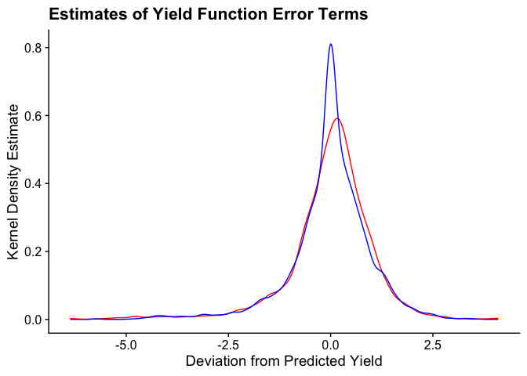

```r
# Load packages
pacman::p_load(tidyverse, here, haven, magrittr)

# Load data
burk_df = read_dta(here("HW1", "data", "burkina731.dta"))

# Change appropriate variables to factors
burk_df %<>% mutate(village = as.factor(village),
                    year = as.factor(year),
                    fcrop = as.factor(fcrop),
                    hhn = as.factor(hhn),
                    hhn_unique = hhn:village)
```


### Question 4


```r
# We're doing this cumbersome method to put the formula in because I thought it was cool, but mostly because I'm lazy and didn't wanna type out all the control variables

# Get vector of all control variables for ease of use
x = c(grep('soil', names(burk_df), value = TRUE), grep('topo', names(burk_df), value = TRUE), grep('loc', names(burk_df), value = TRUE), "lnarea")

# Add village fixed effects
village = c(x, "village*year*fcrop")

# Function that outputs regression formula
formula_generator = function(y = "lnvalue", x){
  a = paste(y, "~", sep = " ")
  paste(a, paste(paste0(x),  collapse = " + ")) |> as.formula()
}

# Village fixed effects formula
village_formula = formula_generator('lnvalue', village)
# Estimate first regression. 
village_reg = lm(village_formula, burk_df)
```


```r
# Now add household fixed effects
household = c(x, "hhn*year*fcrop")

# Formula
household_formula = formula_generator('lnvalue', household)
# Regression
household_reg = lm(household_formula, data = burk_df)
```


```r
# Graph the density of residuals from each regression
resids = tibble(village = village_reg$residuals, household = household_reg$residuals)

# Graph residuals
resids |> 
  ggplot(aes(village)) +
  geom_density(col = 'red') +
  geom_density(aes(x = household), col = 'blue') + 
  xlab("Deviation from Predicted Yield") +  ylab("Kernel Density Estimate") +
  ggtitle("Estimates of Yield Function Error Terms") + 
  cowplot::theme_cowplot()
```

<!-- -->

```r
# Test if distributions are different using KS test
with(resids, ks.test(village, household)) # Reject
```

```
## Warning in ks.test.default(village, household): p-value will be approximate in
## the presence of ties
```

```
## 
## 	Asymptotic two-sample Kolmogorov-Smirnov test
## 
## data:  village and household
## D = 0.078416, p-value = 2.641e-07
## alternative hypothesis: two-sided
```

### Question 5


```r
# Add log of hh size of other plots to data
hhsize = c("lnhhsize", x, "village*year*fcrop")

# Formula
hhsize_formula = formula_generator('lnvalue', hhsize)
# Run regression
other_reg = lm(hhsize_formula, burk_df)
summary(other_reg)
```

```
## 
## Call:
## lm(formula = hhsize_formula, data = burk_df)
## 
## Residuals:
##     Min      1Q  Median      3Q     Max 
## -6.0872 -0.3911  0.1214  0.5671  3.9816 
## 
## Coefficients: (226 not defined because of singularities)
##                         Estimate Std. Error t value Pr(>|t|)    
## (Intercept)             2.953932   0.303290   9.740  < 2e-16 ***
## lnhhsize                0.174497   0.040388   4.320 1.63e-05 ***
## soil7                  -0.185085   0.138588  -1.336 0.181857    
## soil21                  0.334016   0.218695   1.527 0.126833    
## soil31                  0.094384   0.160900   0.587 0.557537    
## soil32                 -0.020781   0.163379  -0.127 0.898799    
## soil33                  0.157360   0.219685   0.716 0.473888    
## soil37                  0.139808   0.208954   0.669 0.503513    
## soil35                  0.037521   0.292574   0.128 0.897967    
## soil45                  0.025093   0.172441   0.146 0.884316    
## soil51                  0.116734   0.098102   1.190 0.234212    
## soil1                   0.130808   0.463260   0.282 0.777693    
## soil3                  -0.152436   0.134633  -1.132 0.257666    
## soil11                 -0.299804   0.252798  -1.186 0.235780    
## soil12                  0.008792   0.239190   0.037 0.970681    
## soil13                  0.326383   0.293937   1.110 0.266961    
## soil34                 -0.361505   0.359567  -1.005 0.314826    
## soil46                 -0.315251   0.257260  -1.225 0.220556    
## soil53                  0.400923   0.216994   1.848 0.064798 .  
## topo1                  -0.475164   0.166265  -2.858 0.004307 ** 
## topo2                  -0.316018   0.149974  -2.107 0.035223 *  
## topo3                  -0.282483   0.147303  -1.918 0.055285 .  
## topo4                  -0.233111   0.145424  -1.603 0.109092    
## loc1                    0.192384   0.083745   2.297 0.021702 *  
## loc2                    0.108107   0.062054   1.742 0.081629 .  
## lnarea                  0.801600   0.027597  29.047  < 2e-16 ***
## village2                0.108706   0.268282   0.405 0.685376    
## village3                0.038698   0.380412   0.102 0.918984    
## village4               -0.405748   0.372149  -1.090 0.275715    
## village5                0.210414   0.366856   0.574 0.566327    
## village6                0.601326   0.422008   1.425 0.154331    
## year2                  -0.982707   0.300866  -3.266 0.001107 ** 
## year3                   0.159812   0.303215   0.527 0.598210    
## fcrop2                 -0.345452   0.483096  -0.715 0.474640    
## fcrop3                 -1.233119   0.370490  -3.328 0.000889 ***
## fcrop4                 -1.141998   0.692329  -1.650 0.099195 .  
## fcrop5                 -0.195300   0.359296  -0.544 0.586799    
## fcrop6                  0.649245   0.728340   0.891 0.372815    
## fcrop7                  0.256602   0.429803   0.597 0.550557    
## fcrop8                 -0.904873   0.684087  -1.323 0.186064    
## fcrop9                 -1.834625   0.709061  -2.587 0.009737 ** 
## fcrop11                -2.189504   0.544132  -4.024 5.93e-05 ***
## fcrop12                -0.101127   0.818696  -0.124 0.901706    
## fcrop15                 0.553959   1.161226   0.477 0.633379    
## fcrop16                -2.795806   0.846429  -3.303 0.000972 ***
## fcrop18                 0.021861   1.148197   0.019 0.984811    
## fcrop20                -2.163290   0.646011  -3.349 0.000826 ***
## fcrop22                -2.375288   0.837037  -2.838 0.004587 ** 
## fcrop24                -1.580683   1.130724  -1.398 0.162279    
## fcrop25                -2.947858   1.150958  -2.561 0.010500 *  
## fcrop31                 0.068667   0.353733   0.194 0.846100    
## fcrop32                -1.817951   1.127860  -1.612 0.107143    
## fcrop44                 1.563614   0.607135   2.575 0.010081 *  
## village2:year2          0.047261   0.376919   0.125 0.900228    
## village3:year2         -0.001006   0.393878  -0.003 0.997963    
## village4:year2          0.955184   0.411286   2.322 0.020305 *  
## village5:year2         -0.095954   0.409053  -0.235 0.814561    
## village6:year2         -0.572311   0.502577  -1.139 0.254936    
## village2:year3         -0.390616   0.374217  -1.044 0.296689    
## village3:year3                NA         NA      NA       NA    
## village4:year3          0.033092   0.407388   0.081 0.935267    
## village5:year3                NA         NA      NA       NA    
## village6:year3         -0.601841   0.499380  -1.205 0.228271    
## village2:fcrop2         0.470685   0.572054   0.823 0.410717    
## village3:fcrop2         0.980590   0.492037   1.993 0.046400 *  
## village4:fcrop2         0.347717   0.549557   0.633 0.526984    
## village5:fcrop2         0.582572   0.482452   1.208 0.227368    
## village6:fcrop2         0.069251   0.605607   0.114 0.908971    
## village2:fcrop3               NA         NA      NA       NA    
## village3:fcrop3         0.279897   0.485219   0.577 0.564105    
## village4:fcrop3         1.612200   0.560670   2.875 0.004075 ** 
## village5:fcrop3         0.145632   0.469405   0.310 0.756404    
## village6:fcrop3               NA         NA      NA       NA    
## village2:fcrop4        -1.835730   1.310690  -1.401 0.161487    
## village3:fcrop4         0.416641   0.824826   0.505 0.613523    
## village4:fcrop4         0.989085   0.899021   1.100 0.271380    
## village5:fcrop4               NA         NA      NA       NA    
## village6:fcrop4         1.138860   1.071779   1.063 0.288091    
## village2:fcrop5        -0.639217   0.425086  -1.504 0.132801    
## village3:fcrop5        -0.728754   0.451091  -1.616 0.106345    
## village4:fcrop5         1.190194   0.453812   2.623 0.008788 ** 
## village5:fcrop5        -0.816379   0.445720  -1.832 0.067154 .  
## village6:fcrop5         1.795962   0.506120   3.548 0.000396 ***
## village2:fcrop6        -0.933022   0.880717  -1.059 0.289545    
## village3:fcrop6         0.256922   1.218872   0.211 0.833074    
## village4:fcrop6        -0.019129   1.216545  -0.016 0.987456    
## village5:fcrop6         0.821994   0.732843   1.122 0.262140    
## village6:fcrop6               NA         NA      NA       NA    
## village2:fcrop7         0.533608   0.533845   1.000 0.317641    
## village3:fcrop7               NA         NA      NA       NA    
## village4:fcrop7               NA         NA      NA       NA    
## village5:fcrop7               NA         NA      NA       NA    
## village6:fcrop7               NA         NA      NA       NA    
## village2:fcrop8         1.155532   0.807472   1.431 0.152565    
## village3:fcrop8         0.487417   1.016036   0.480 0.631474    
## village4:fcrop8         1.722305   0.748126   2.302 0.021424 *  
## village5:fcrop8        -0.643196   0.968478  -0.664 0.506680    
## village6:fcrop8         0.360760   0.798826   0.452 0.651595    
## village2:fcrop9         1.304949   1.323397   0.986 0.324218    
## village3:fcrop9               NA         NA      NA       NA    
## village4:fcrop9               NA         NA      NA       NA    
## village5:fcrop9        -1.340424   0.799997  -1.676 0.093978 .  
## village6:fcrop9               NA         NA      NA       NA    
## village2:fcrop11              NA         NA      NA       NA    
## village3:fcrop11              NA         NA      NA       NA    
## village4:fcrop11              NA         NA      NA       NA    
## village5:fcrop11        0.131946   1.221324   0.108 0.913978    
## village6:fcrop11              NA         NA      NA       NA    
## village2:fcrop12        1.020103   1.038275   0.982 0.325968    
## village3:fcrop12              NA         NA      NA       NA    
## village4:fcrop12              NA         NA      NA       NA    
## village5:fcrop12       -4.880239   1.366113  -3.572 0.000362 ***
## village6:fcrop12       -2.495663   0.993539  -2.512 0.012083 *  
## village2:fcrop15              NA         NA      NA       NA    
## village3:fcrop15        3.656412   1.342439   2.724 0.006509 ** 
## village4:fcrop15        0.798456   1.220442   0.654 0.513032    
## village5:fcrop15        0.708707   1.702546   0.416 0.677260    
## village6:fcrop15              NA         NA      NA       NA    
## village2:fcrop16              NA         NA      NA       NA    
## village3:fcrop16        3.894919   1.274716   3.056 0.002275 ** 
## village4:fcrop16              NA         NA      NA       NA    
## village5:fcrop16              NA         NA      NA       NA    
## village6:fcrop16              NA         NA      NA       NA    
## village2:fcrop18              NA         NA      NA       NA    
## village3:fcrop18              NA         NA      NA       NA    
## village4:fcrop18              NA         NA      NA       NA    
## village5:fcrop18       -2.362589   1.398188  -1.690 0.091225 .  
## village6:fcrop18              NA         NA      NA       NA    
## village2:fcrop20              NA         NA      NA       NA    
## village3:fcrop20              NA         NA      NA       NA    
## village4:fcrop20              NA         NA      NA       NA    
## village5:fcrop20              NA         NA      NA       NA    
## village6:fcrop20              NA         NA      NA       NA    
## village2:fcrop22        3.032914   0.945903   3.206 0.001364 ** 
## village3:fcrop22              NA         NA      NA       NA    
## village4:fcrop22              NA         NA      NA       NA    
## village5:fcrop22        4.589952   1.607105   2.856 0.004332 ** 
## village6:fcrop22              NA         NA      NA       NA    
## village2:fcrop24              NA         NA      NA       NA    
## village3:fcrop24              NA         NA      NA       NA    
## village4:fcrop24              NA         NA      NA       NA    
## village5:fcrop24              NA         NA      NA       NA    
## village6:fcrop24              NA         NA      NA       NA    
## village2:fcrop25              NA         NA      NA       NA    
## village3:fcrop25              NA         NA      NA       NA    
## village4:fcrop25              NA         NA      NA       NA    
## village5:fcrop25              NA         NA      NA       NA    
## village6:fcrop25              NA         NA      NA       NA    
## village2:fcrop31              NA         NA      NA       NA    
## village3:fcrop31       -0.967722   1.167198  -0.829 0.407143    
## village4:fcrop31              NA         NA      NA       NA    
## village5:fcrop31       -0.168506   0.400410  -0.421 0.673920    
## village6:fcrop31              NA         NA      NA       NA    
## village2:fcrop32              NA         NA      NA       NA    
## village3:fcrop32              NA         NA      NA       NA    
## village4:fcrop32              NA         NA      NA       NA    
## village5:fcrop32              NA         NA      NA       NA    
## village6:fcrop32              NA         NA      NA       NA    
## village2:fcrop44              NA         NA      NA       NA    
## village3:fcrop44              NA         NA      NA       NA    
## village4:fcrop44              NA         NA      NA       NA    
## village5:fcrop44        1.541424   1.054063   1.462 0.143792    
## village6:fcrop44              NA         NA      NA       NA    
## year2:fcrop2           -0.301763   0.620645  -0.486 0.626870    
## year3:fcrop2           -0.239410   0.591513  -0.405 0.685709    
## year2:fcrop3            1.327225   0.504535   2.631 0.008586 ** 
## year3:fcrop3            1.201958   0.531331   2.262 0.023789 *  
## year2:fcrop4                  NA         NA      NA       NA    
## year3:fcrop4                  NA         NA      NA       NA    
## year2:fcrop5            0.039560   0.495595   0.080 0.936385    
## year3:fcrop5            1.311789   0.484244   2.709 0.006805 ** 
## year2:fcrop6           -0.332435   0.830848  -0.400 0.689113    
## year3:fcrop6           -0.053435   0.820579  -0.065 0.948086    
## year2:fcrop7            0.402674   1.198518   0.336 0.736922    
## year3:fcrop7            1.218601   1.196341   1.019 0.308508    
## year2:fcrop8            0.898855   0.582476   1.543 0.122942    
## year3:fcrop8            1.064320   0.573605   1.855 0.063666 .  
## year2:fcrop9            2.867053   0.931644   3.077 0.002115 ** 
## year3:fcrop9            1.195069   0.895198   1.335 0.182029    
## year2:fcrop11           1.671990   0.730497   2.289 0.022188 *  
## year3:fcrop11           1.278666   0.728114   1.756 0.079212 .  
## year2:fcrop12           1.798733   1.001717   1.796 0.072695 .  
## year3:fcrop12           1.982637   1.001160   1.980 0.047796 *  
## year2:fcrop15           0.752099   1.623522   0.463 0.643232    
## year3:fcrop15          -2.905148   0.579131  -5.016 5.71e-07 ***
## year2:fcrop16           1.412678   1.409065   1.003 0.316187    
## year3:fcrop16           0.209595   1.581175   0.133 0.894557    
## year2:fcrop18           2.664505   1.133559   2.351 0.018837 *  
## year3:fcrop18                 NA         NA      NA       NA    
## year2:fcrop20           2.464977   0.881292   2.797 0.005205 ** 
## year3:fcrop20                 NA         NA      NA       NA    
## year2:fcrop22           1.138841   1.402733   0.812 0.416957    
## year3:fcrop22           0.219825   1.208462   0.182 0.855675    
## year2:fcrop24           3.322126   1.594384   2.084 0.037314 *  
## year3:fcrop24                 NA         NA      NA       NA    
## year2:fcrop25                 NA         NA      NA       NA    
## year3:fcrop25                 NA         NA      NA       NA    
## year2:fcrop31           1.221157   0.458757   2.662 0.007830 ** 
## year3:fcrop31           0.371342   0.460939   0.806 0.420553    
## year2:fcrop32                 NA         NA      NA       NA    
## year3:fcrop32                 NA         NA      NA       NA    
## year2:fcrop44           0.430577   0.742038   0.580 0.561799    
## year3:fcrop44          -2.768646   0.903068  -3.066 0.002198 ** 
## village2:year2:fcrop2   0.111006   0.785586   0.141 0.887644    
## village3:year2:fcrop2   0.278377   0.657388   0.423 0.672004    
## village4:year2:fcrop2   0.844562   0.715213   1.181 0.237795    
## village5:year2:fcrop2   0.022628   0.662856   0.034 0.972771    
## village6:year2:fcrop2   0.872929   0.792690   1.101 0.270926    
## village2:year3:fcrop2   0.003649   0.811122   0.004 0.996411    
## village3:year3:fcrop2         NA         NA      NA       NA    
## village4:year3:fcrop2   0.367096   0.687529   0.534 0.593443    
## village5:year3:fcrop2         NA         NA      NA       NA    
## village6:year3:fcrop2   0.642734   0.768501   0.836 0.403055    
## village2:year2:fcrop3         NA         NA      NA       NA    
## village3:year2:fcrop3   0.541641   0.662534   0.818 0.413719    
## village4:year2:fcrop3  -1.045578   0.782554  -1.336 0.181658    
## village5:year2:fcrop3   0.510842   0.672862   0.759 0.447814    
## village6:year2:fcrop3         NA         NA      NA       NA    
## village2:year3:fcrop3         NA         NA      NA       NA    
## village3:year3:fcrop3         NA         NA      NA       NA    
## village4:year3:fcrop3  -1.489607   0.766694  -1.943 0.052163 .  
## village5:year3:fcrop3         NA         NA      NA       NA    
## village6:year3:fcrop3         NA         NA      NA       NA    
## village2:year2:fcrop4         NA         NA      NA       NA    
## village3:year2:fcrop4         NA         NA      NA       NA    
## village4:year2:fcrop4         NA         NA      NA       NA    
## village5:year2:fcrop4         NA         NA      NA       NA    
## village6:year2:fcrop4         NA         NA      NA       NA    
## village2:year3:fcrop4         NA         NA      NA       NA    
## village3:year3:fcrop4         NA         NA      NA       NA    
## village4:year3:fcrop4         NA         NA      NA       NA    
## village5:year3:fcrop4         NA         NA      NA       NA    
## village6:year3:fcrop4         NA         NA      NA       NA    
## village2:year2:fcrop5  -0.509025   0.624077  -0.816 0.414796    
## village3:year2:fcrop5   2.217819   0.636382   3.485 0.000502 ***
## village4:year2:fcrop5   0.099616   0.644718   0.155 0.877222    
## village5:year2:fcrop5   2.091436   0.643832   3.248 0.001179 ** 
## village6:year2:fcrop5  -0.805097   0.686271  -1.173 0.240870    
## village2:year3:fcrop5  -1.777937   0.605533  -2.936 0.003359 ** 
## village3:year3:fcrop5         NA         NA      NA       NA    
## village4:year3:fcrop5  -1.927500   0.625309  -3.082 0.002080 ** 
## village5:year3:fcrop5         NA         NA      NA       NA    
## village6:year3:fcrop5  -2.722996   0.671963  -4.052 5.26e-05 ***
## village2:year2:fcrop6   0.429425   1.120845   0.383 0.701665    
## village3:year2:fcrop6  -3.418046   1.409720  -2.425 0.015408 *  
## village4:year2:fcrop6         NA         NA      NA       NA    
## village5:year2:fcrop6  -1.733368   0.969497  -1.788 0.073936 .  
## village6:year2:fcrop6         NA         NA      NA       NA    
## village2:year3:fcrop6   0.704150   1.248835   0.564 0.572920    
## village3:year3:fcrop6         NA         NA      NA       NA    
## village4:year3:fcrop6         NA         NA      NA       NA    
## village5:year3:fcrop6         NA         NA      NA       NA    
## village6:year3:fcrop6         NA         NA      NA       NA    
## village2:year2:fcrop7  -0.768131   1.474027  -0.521 0.602345    
## village3:year2:fcrop7         NA         NA      NA       NA    
## village4:year2:fcrop7         NA         NA      NA       NA    
## village5:year2:fcrop7         NA         NA      NA       NA    
## village6:year2:fcrop7         NA         NA      NA       NA    
## village2:year3:fcrop7  -0.726819   1.663714  -0.437 0.662254    
## village3:year3:fcrop7         NA         NA      NA       NA    
## village4:year3:fcrop7         NA         NA      NA       NA    
## village5:year3:fcrop7         NA         NA      NA       NA    
## village6:year3:fcrop7         NA         NA      NA       NA    
## village2:year2:fcrop8  -0.610708   1.085181  -0.563 0.573651    
## village3:year2:fcrop8   0.570307   0.851461   0.670 0.503061    
## village4:year2:fcrop8  -1.055004   0.736868  -1.432 0.152368    
## village5:year2:fcrop8   1.647409   0.899945   1.831 0.067307 .  
## village6:year2:fcrop8         NA         NA      NA       NA    
## village2:year3:fcrop8         NA         NA      NA       NA    
## village3:year3:fcrop8         NA         NA      NA       NA    
## village4:year3:fcrop8  -1.401606   0.741038  -1.891 0.058708 .  
## village5:year3:fcrop8         NA         NA      NA       NA    
## village6:year3:fcrop8         NA         NA      NA       NA    
## village2:year2:fcrop9         NA         NA      NA       NA    
## village3:year2:fcrop9         NA         NA      NA       NA    
## village4:year2:fcrop9         NA         NA      NA       NA    
## village5:year2:fcrop9   1.439062   1.510524   0.953 0.340857    
## village6:year2:fcrop9         NA         NA      NA       NA    
## village2:year3:fcrop9         NA         NA      NA       NA    
## village3:year3:fcrop9         NA         NA      NA       NA    
## village4:year3:fcrop9         NA         NA      NA       NA    
## village5:year3:fcrop9         NA         NA      NA       NA    
## village6:year3:fcrop9         NA         NA      NA       NA    
## village2:year2:fcrop11        NA         NA      NA       NA    
## village3:year2:fcrop11        NA         NA      NA       NA    
## village4:year2:fcrop11        NA         NA      NA       NA    
## village5:year2:fcrop11        NA         NA      NA       NA    
## village6:year2:fcrop11        NA         NA      NA       NA    
## village2:year3:fcrop11        NA         NA      NA       NA    
## village3:year3:fcrop11        NA         NA      NA       NA    
## village4:year3:fcrop11        NA         NA      NA       NA    
## village5:year3:fcrop11        NA         NA      NA       NA    
## village6:year3:fcrop11        NA         NA      NA       NA    
## village2:year2:fcrop12        NA         NA      NA       NA    
## village3:year2:fcrop12        NA         NA      NA       NA    
## village4:year2:fcrop12        NA         NA      NA       NA    
## village5:year2:fcrop12  3.127968   1.483188   2.109 0.035067 *  
## village6:year2:fcrop12        NA         NA      NA       NA    
## village2:year3:fcrop12 -2.744067   1.632575  -1.681 0.092947 .  
## village3:year3:fcrop12        NA         NA      NA       NA    
## village4:year3:fcrop12        NA         NA      NA       NA    
## village5:year3:fcrop12        NA         NA      NA       NA    
## village6:year3:fcrop12        NA         NA      NA       NA    
## village2:year2:fcrop15        NA         NA      NA       NA    
## village3:year2:fcrop15 -3.652010   1.800545  -2.028 0.042658 *  
## village4:year2:fcrop15 -0.247572   1.714774  -0.144 0.885218    
## village5:year2:fcrop15  0.652379   2.332054   0.280 0.779701    
## village6:year2:fcrop15        NA         NA      NA       NA    
## village2:year3:fcrop15        NA         NA      NA       NA    
## village3:year3:fcrop15        NA         NA      NA       NA    
## village4:year3:fcrop15        NA         NA      NA       NA    
## village5:year3:fcrop15        NA         NA      NA       NA    
## village6:year3:fcrop15        NA         NA      NA       NA    
## village2:year2:fcrop16        NA         NA      NA       NA    
## village3:year2:fcrop16        NA         NA      NA       NA    
## village4:year2:fcrop16        NA         NA      NA       NA    
## village5:year2:fcrop16        NA         NA      NA       NA    
## village6:year2:fcrop16        NA         NA      NA       NA    
## village2:year3:fcrop16        NA         NA      NA       NA    
## village3:year3:fcrop16        NA         NA      NA       NA    
## village4:year3:fcrop16        NA         NA      NA       NA    
## village5:year3:fcrop16        NA         NA      NA       NA    
## village6:year3:fcrop16        NA         NA      NA       NA    
## village2:year2:fcrop18        NA         NA      NA       NA    
## village3:year2:fcrop18        NA         NA      NA       NA    
## village4:year2:fcrop18        NA         NA      NA       NA    
## village5:year2:fcrop18        NA         NA      NA       NA    
## village6:year2:fcrop18        NA         NA      NA       NA    
## village2:year3:fcrop18        NA         NA      NA       NA    
## village3:year3:fcrop18        NA         NA      NA       NA    
## village4:year3:fcrop18        NA         NA      NA       NA    
## village5:year3:fcrop18        NA         NA      NA       NA    
## village6:year3:fcrop18        NA         NA      NA       NA    
## village2:year2:fcrop20        NA         NA      NA       NA    
## village3:year2:fcrop20        NA         NA      NA       NA    
## village4:year2:fcrop20        NA         NA      NA       NA    
## village5:year2:fcrop20        NA         NA      NA       NA    
## village6:year2:fcrop20        NA         NA      NA       NA    
## village2:year3:fcrop20        NA         NA      NA       NA    
## village3:year3:fcrop20        NA         NA      NA       NA    
## village4:year3:fcrop20        NA         NA      NA       NA    
## village5:year3:fcrop20        NA         NA      NA       NA    
## village6:year3:fcrop20        NA         NA      NA       NA    
## village2:year2:fcrop22 -2.130195   1.856134  -1.148 0.251244    
## village3:year2:fcrop22        NA         NA      NA       NA    
## village4:year2:fcrop22        NA         NA      NA       NA    
## village5:year2:fcrop22 -0.322185   2.055319  -0.157 0.875452    
## village6:year2:fcrop22        NA         NA      NA       NA    
## village2:year3:fcrop22        NA         NA      NA       NA    
## village3:year3:fcrop22        NA         NA      NA       NA    
## village4:year3:fcrop22        NA         NA      NA       NA    
## village5:year3:fcrop22        NA         NA      NA       NA    
## village6:year3:fcrop22        NA         NA      NA       NA    
## village2:year2:fcrop24        NA         NA      NA       NA    
## village3:year2:fcrop24        NA         NA      NA       NA    
## village4:year2:fcrop24        NA         NA      NA       NA    
## village5:year2:fcrop24        NA         NA      NA       NA    
## village6:year2:fcrop24        NA         NA      NA       NA    
## village2:year3:fcrop24        NA         NA      NA       NA    
## village3:year3:fcrop24        NA         NA      NA       NA    
## village4:year3:fcrop24        NA         NA      NA       NA    
## village5:year3:fcrop24        NA         NA      NA       NA    
## village6:year3:fcrop24        NA         NA      NA       NA    
## village2:year2:fcrop25        NA         NA      NA       NA    
## village3:year2:fcrop25        NA         NA      NA       NA    
## village4:year2:fcrop25        NA         NA      NA       NA    
## village5:year2:fcrop25        NA         NA      NA       NA    
## village6:year2:fcrop25        NA         NA      NA       NA    
## village2:year3:fcrop25        NA         NA      NA       NA    
## village3:year3:fcrop25        NA         NA      NA       NA    
## village4:year3:fcrop25        NA         NA      NA       NA    
## village5:year3:fcrop25        NA         NA      NA       NA    
## village6:year3:fcrop25        NA         NA      NA       NA    
## village2:year2:fcrop31        NA         NA      NA       NA    
## village3:year2:fcrop31  1.213658   1.645176   0.738 0.460775    
## village4:year2:fcrop31        NA         NA      NA       NA    
## village5:year2:fcrop31  0.602292   0.570358   1.056 0.291095    
## village6:year2:fcrop31        NA         NA      NA       NA    
## village2:year3:fcrop31        NA         NA      NA       NA    
## village3:year3:fcrop31        NA         NA      NA       NA    
## village4:year3:fcrop31        NA         NA      NA       NA    
## village5:year3:fcrop31        NA         NA      NA       NA    
## village6:year3:fcrop31        NA         NA      NA       NA    
## village2:year2:fcrop32        NA         NA      NA       NA    
## village3:year2:fcrop32        NA         NA      NA       NA    
## village4:year2:fcrop32        NA         NA      NA       NA    
## village5:year2:fcrop32        NA         NA      NA       NA    
## village6:year2:fcrop32        NA         NA      NA       NA    
## village2:year3:fcrop32        NA         NA      NA       NA    
## village3:year3:fcrop32        NA         NA      NA       NA    
## village4:year3:fcrop32        NA         NA      NA       NA    
## village5:year3:fcrop32        NA         NA      NA       NA    
## village6:year3:fcrop32        NA         NA      NA       NA    
## village2:year2:fcrop44        NA         NA      NA       NA    
## village3:year2:fcrop44        NA         NA      NA       NA    
## village4:year2:fcrop44        NA         NA      NA       NA    
## village5:year2:fcrop44 -1.606997   1.284514  -1.251 0.211054    
## village6:year2:fcrop44        NA         NA      NA       NA    
## village2:year3:fcrop44        NA         NA      NA       NA    
## village3:year3:fcrop44        NA         NA      NA       NA    
## village4:year3:fcrop44        NA         NA      NA       NA    
## village5:year3:fcrop44        NA         NA      NA       NA    
## village6:year3:fcrop44        NA         NA      NA       NA    
## ---
## Signif. codes:  0 '***' 0.001 '**' 0.01 '*' 0.05 '.' 0.1 ' ' 1
## 
## Residual standard error: 1.098 on 2093 degrees of freedom
##   (306 observations deleted due to missingness)
## Multiple R-squared:  0.6702,	Adjusted R-squared:  0.6424 
## F-statistic: 24.16 on 176 and 2093 DF,  p-value: < 2.2e-16
```


