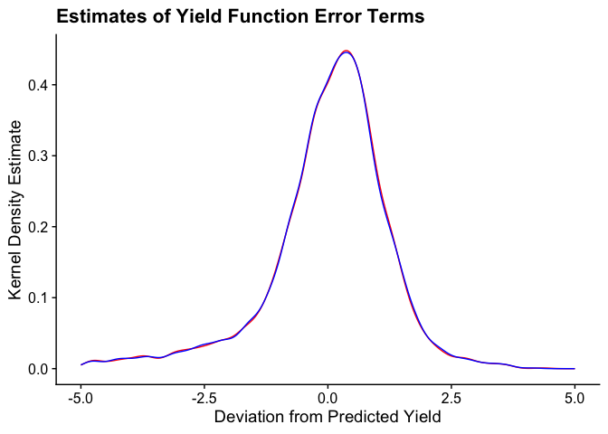

### Question 1


```r
# Load packages
pacman::p_load(tidyverse, magrittr, here, haven)

# Load data
burk_df = read_dta(here("HW1", "data", "burkina731.dta"))
```


### Question 4


```r
# Get vector of all control variables for ease of use
x = c(grep('soil', names(burk_df), value = TRUE), grep('topo', names(burk_df), value = TRUE), grep('loc', names(burk_df), value = TRUE), "lnarea")

# Add village fixed effects
village = c(x, "village*year*fcrop")
  
# Estimate first regression. We're doing this cumbersome method to put the formula in because I thought it was cool, but mostly because I'm lazy and didn't wanna type out all the control variables
village_reg = burk_df %>% lm(paste("lnvalue ~", paste(paste0(village),  collapse = " + ")),.)

# Now add household fixed effects
household = c(x, "hhn*year*fcrop")

household_reg = burk_df %>% lm(paste("lnvalue ~", paste(paste0(household),  collapse = " + ")),.)

# Graph the density of residuals from each regression
resids = tibble(village = village_reg$residuals, household = household_reg$residuals)

# Graph residuals
resids |> 
  ggplot(aes(village)) +
  geom_density(col = 'red') +
  geom_density(aes(x = household), col = 'blue') + 
  xlab("Deviation from Predicted Yield") +  ylab("Kernel Density Estimate") +
  xlim(-5,5) + 
  ggtitle("Estimates of Yield Function Error Terms") + 
  cowplot::theme_cowplot()
```

```
## Warning: Removed 15 rows containing non-finite values (`stat_density()`).
## Removed 15 rows containing non-finite values (`stat_density()`).
```

<!-- -->

```r
# Test if distributions are different using KS test
with(resids, ks.test(village, household)) # Fail to reject
```

```
## 
## 	Asymptotic two-sample Kolmogorov-Smirnov test
## 
## data:  village and household
## D = 0.0089286, p-value = 1
## alternative hypothesis: two-sided
```

### Question 5


```r
# Add log of total area of other plots to data
other_area = c("lnhhsize", x)

# Run regression
other_reg = burk_df %>% lm(paste("lnvalue ~", paste(paste0(other_area),  collapse = " + ")),.)

summary(other_reg)
```

```
## 
## Call:
## lm(formula = paste("lnvalue ~", paste(paste0(other_area), collapse = " + ")), 
##     data = .)
## 
## Residuals:
##     Min      1Q  Median      3Q     Max 
## -6.6604 -0.5257  0.1793  0.7559  4.2920 
## 
## Coefficients:
##             Estimate Std. Error t value Pr(>|t|)    
## (Intercept)  2.67907    0.17938  14.935  < 2e-16 ***
## lnhhsize     0.20102    0.04439   4.528 6.25e-06 ***
## soil7        0.01678    0.14345   0.117  0.90690    
## soil21       0.27781    0.10838   2.563  0.01043 *  
## soil31       0.15205    0.11827   1.286  0.19871    
## soil32       0.23086    0.11842   1.950  0.05135 .  
## soil33       0.34698    0.20138   1.723  0.08502 .  
## soil37       0.44648    0.18123   2.464  0.01383 *  
## soil35       0.47158    0.28354   1.663  0.09642 .  
## soil45       0.17390    0.12990   1.339  0.18080    
## soil51       0.45617    0.09158   4.981 6.81e-07 ***
## soil1        0.99783    0.38611   2.584  0.00982 ** 
## soil3        0.02558    0.14146   0.181  0.85650    
## soil11      -1.21897    0.17268  -7.059 2.23e-12 ***
## soil12      -0.31991    0.16360  -1.955  0.05066 .  
## soil13       0.02446    0.21012   0.116  0.90732    
## soil34      -0.55712    0.38525  -1.446  0.14828    
## soil46      -0.08429    0.26076  -0.323  0.74653    
## soil53       0.46353    0.23071   2.009  0.04464 *  
## topo1       -0.39399    0.15815  -2.491  0.01280 *  
## topo2       -0.32478    0.14188  -2.289  0.02217 *  
## topo3       -0.31601    0.13853  -2.281  0.02263 *  
## topo4       -0.15845    0.14503  -1.092  0.27474    
## loc1         0.22296    0.08885   2.509  0.01216 *  
## loc2         0.19198    0.06562   2.926  0.00347 ** 
## lnarea       0.74353    0.01896  39.220  < 2e-16 ***
## ---
## Signif. codes:  0 '***' 0.001 '**' 0.01 '*' 0.05 '.' 0.1 ' ' 1
## 
## Residual standard error: 1.301 on 2244 degrees of freedom
##   (306 observations deleted due to missingness)
## Multiple R-squared:  0.5034,	Adjusted R-squared:  0.4979 
## F-statistic:    91 on 25 and 2244 DF,  p-value: < 2.2e-16
```


